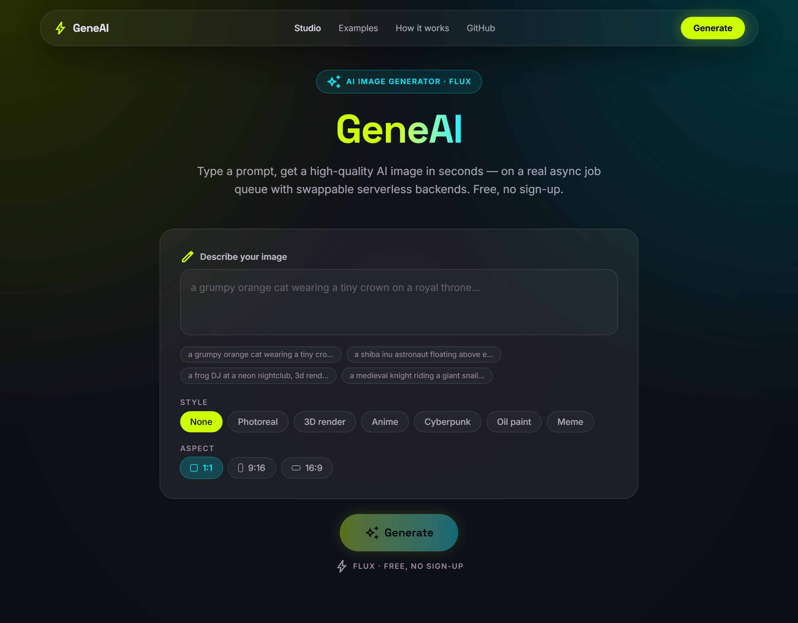
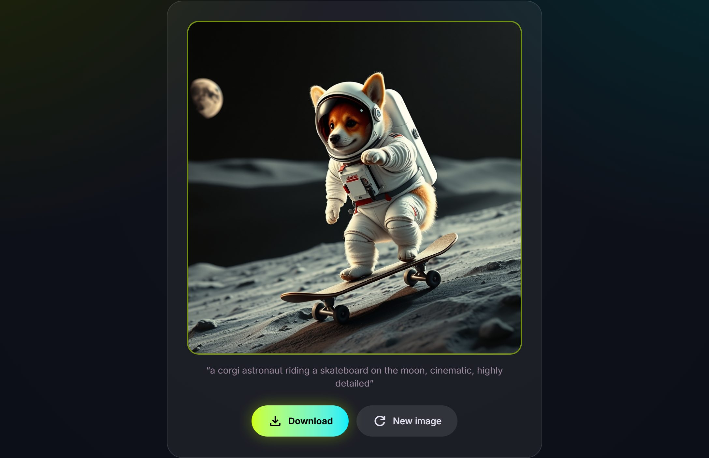
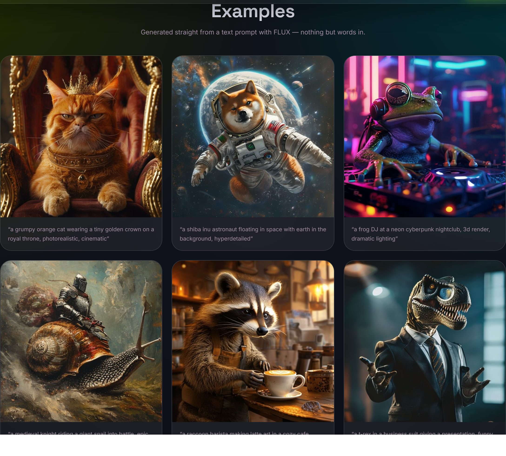

<h1 align="center">🌀 GeneAI</h1>

<p align="center">
  <b>Type a prompt → get a high-quality AI image in seconds.</b><br/>
  A FLUX image generator built on a real async job queue — <b>free, no sign-up, no credit card.</b>
</p>

<p align="center">
  <a href="https://geneai-git-main-abdulelah-cs7890s-projects.vercel.app"><b>▶ Live demo</b></a>
  &nbsp;·&nbsp; <a href="#-quick-start">Quick start</a>
  &nbsp;·&nbsp; <a href="ARCHITECTURE.md">Architecture</a>
  &nbsp;·&nbsp; <a href="DEPLOY.md">Deploy</a>
</p>

<p align="center">
  
  
  
  
</p>

<p align="center">
  
</p>

---

## What it does

Describe anything, pick a style + aspect, and GeneAI renders it with **FLUX** — a real,
high-quality image, generated in seconds. No uploads, no accounts.

<p align="center">
  
</p>

## Features

- 🎨 **FLUX-grade quality** — text → image via Cloudflare Workers AI (free tier, no card).
- ⚡ **Real async pipeline** — a job queue with a live `queued → generating → done` timeline (not a fake spinner).
- 🧩 **Swappable backends** — job store, storage, and image engine are each env-selected; runs locally with zero setup.
- 🛟 **Browser fallback** — if no engine is configured, the visitor's browser generates on its own IP, so it always works.
- 🛡️ **Guardrails** — prompt safety gate + per-IP rate limit + daily cap.
- 💅 **Glassmorphism UI** — Tailwind v4, Space Grotesk + Inter, lime/cyan theme.

## Examples

Every image below was generated straight from a text prompt with FLUX:

<p align="center">
  
</p>

## 🚀 Quick start

```bash
npm install
npm run dev          # open the printed http://localhost:PORT
```

With **zero config** it runs fully locally (file-backed job store + on-disk storage) and
generates via the browser fallback. Set a couple of env vars to go cloud — see
[DEPLOY.md](DEPLOY.md) (Supabase + Vercel + Cloudflare, all free, no card).

## How it works

```
 Browser ──prompt──▶ Next.js API ──▶ moderate ──▶ Job Store ◀── poll ── Browser
                          │                       (file / Upstash / Supabase)
                          └─ after(): Compute ──▶ FLUX (Cloudflare) ──▶ Storage
                                                                        (disk / Supabase / R2)
```

| Concern   | Interface                                | Local        | Cloud                |
| --------- | ---------------------------------------- | ------------ | -------------------- |
| Job store | [`JobStore`](lib/jobs/store.ts)          | file `./data`| Upstash / Supabase   |
| Storage   | [`Storage`](lib/storage/index.ts)        | disk         | Supabase / R2        |
| Image     | [`ComputeBackend`](lib/compute/index.ts) | browser FLUX | Cloudflare FLUX      |

Generation runs in the background via Next's `after()`, so the API responds instantly and
the UI polls for progress. More in **[ARCHITECTURE.md](ARCHITECTURE.md)**.

## Testing

```bash
npm run dev
npm run smoke -- http://localhost:3000   # use the port next dev prints
```

Creates a real job, drives it to `done`, asserts the result is an image, and confirms the
NSFW reject path. Point it at the live URL to smoke-test production.

## Project layout

```
app/         page.tsx (studio + gallery), api/jobs (create/list/status), api/files (local)
components/  Studio.tsx — prompt → progress → result
lib/         config (backend selection), jobs (queue + state machine), storage, compute, styles, moderation
scripts/     smoke.mjs (e2e test), gen-examples.mjs (regenerate gallery)
```

---

<p align="center"><sub>Built with Next.js · Tailwind v4 · Cloudflare Workers AI · Supabase · Vercel — entirely on free, no-card infrastructure.</sub></p>
